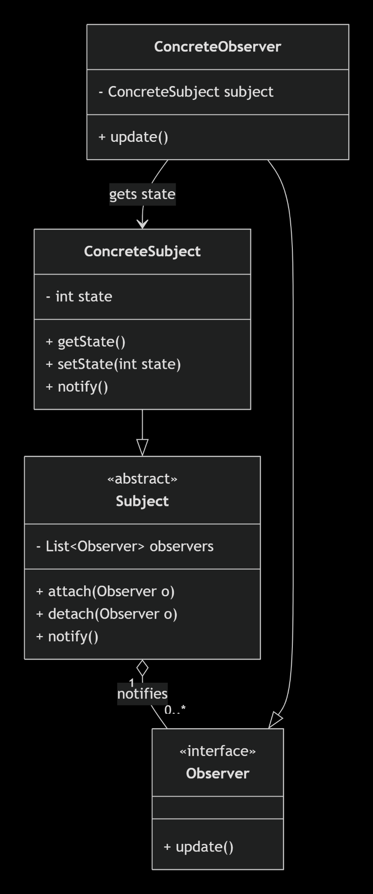

# Observer Design Pattern in TypeScript




The **Observer Design Pattern** is a behavioral design pattern used when one object changes its state and **multiple other objects need to know about that change automatically**.

The easiest way to understand it is through a real-world scenario. Suppose we are building an e-commerce application. A customer places an order, and after the order is created, several things need to happen: the customer should receive an email, the warehouse should start preparing the order, an analytics system should record the purchase, and perhaps a notification service should send a push notification. The order itself should not need to know how email, warehouse, analytics, or notifications work.

This is exactly the problem the Observer Pattern solves.

The object whose state changes is called the **Subject** or **Observable**, while the objects that want to receive updates are called **Observers**.

The important idea is that the Subject maintains a collection of Observers. When something interesting happens, the Subject notifies all registered Observers. Each Observer then decides what it wants to do with that notification.

---

## 1. The problem without Observer Pattern

Let's first write the code in the way we might naturally write it.

Imagine an `OrderService`:

```ts
class OrderService {
  createOrder(orderId: string) {
    console.log(`Order ${orderId} created`);

    this.sendEmail(orderId);
    this.sendNotification(orderId);
    this.updateAnalytics(orderId);
    this.notifyWarehouse(orderId);
  }

  private sendEmail(orderId: string) {
    console.log(`Sending email for order ${orderId}`);
  }

  private sendNotification(orderId: string) {
    console.log(`Sending push notification for order ${orderId}`);
  }

  private updateAnalytics(orderId: string) {
    console.log(`Updating analytics for order ${orderId}`);
  }

  private notifyWarehouse(orderId: string) {
    console.log(`Notifying warehouse for order ${orderId}`);
  }
}
```

At first this looks fine.

But imagine the application grows. Now after an order is created, we also need to update a loyalty system, send an SMS, update a recommendation engine, notify a payment system, and create an audit log.

Our `OrderService` starts becoming responsible for everything:

```text
OrderService
    ├── Email
    ├── Push Notification
    ├── Analytics
    ├── Warehouse
    ├── SMS
    ├── Loyalty
    ├── Recommendation
    ├── Payment
    └── Audit Log
```

The main problem is **tight coupling**.

`OrderService` knows that these systems exist. It knows how to call them. If we remove the analytics system, we have to modify `OrderService`. If we add another system, we again modify `OrderService`.

This violates an important design principle: a class should not have to know about every component that depends on it.

The Observer Pattern solves this by making the `OrderService` aware only of **observers**, not of the concrete systems performing the work.

---

# 2. How Observer Pattern changes the design

Instead of saying:

> "When an order is created, directly call EmailService, NotificationService, AnalyticsService, etc."

we say:

> "When an order is created, notify everyone who is interested in order-created events."

Now `OrderService` doesn't care who is listening.

For example:

```text
OrderService
    |
    | order created
    |
    v
Observers
    |
    ├── EmailObserver
    ├── NotificationObserver
    ├── AnalyticsObserver
    └── WarehouseObserver
```

The important part is that `OrderService` does not directly depend on these concrete classes.

---

# 3. Observer Pattern participants

There are usually four important components.

The **Subject** is the object whose state changes. It maintains a list of observers and provides methods for registering and removing them. In our example, `OrderService` will be the Subject.

The **Observer** is an object that wants to receive updates. Every observer follows a common interface such as `update()`.

The **Concrete Subject** contains the actual business logic and triggers notifications when something important happens.

The **Concrete Observers** implement the Observer interface and perform their individual actions when notified.

In TypeScript, this maps very naturally to interfaces and classes.

---

# 4. Creating the Observer interface

Let's start with the Observer.

```ts
interface Observer {
  update(orderId: string): void;
}
```

This interface says:

> Any object that wants to observe an order event must provide an `update()` method.

Now we can create different observers.

```ts
class EmailObserver implements Observer {
  update(orderId: string): void {
    console.log(`Sending email for order ${orderId}`);
  }
}
```

Another observer:

```ts
class NotificationObserver implements Observer {
  update(orderId: string): void {
    console.log(`Sending push notification for order ${orderId}`);
  }
}
```

And another:

```ts
class AnalyticsObserver implements Observer {
  update(orderId: string): void {
    console.log(`Updating analytics for order ${orderId}`);
  }
}
```

Notice something important here.

None of these classes know about `OrderService`.

They only know that they will receive an `orderId`.

That is what reduces coupling.

---

# 5. Creating the Subject

Now we create the Subject interface.

```ts
interface Subject {
  subscribe(observer: Observer): void;
  unsubscribe(observer: Observer): void;
  notify(orderId: string): void;
}
```

The Subject provides three operations.

`subscribe()` allows an observer to start receiving events.

`unsubscribe()` allows an observer to stop receiving events.

`notify()` tells all currently registered observers that something happened.

Now we can implement it.

```ts
class OrderService implements Subject {
  private observers: Observer[] = [];

  subscribe(observer: Observer): void {
    this.observers.push(observer);
  }

  unsubscribe(observer: Observer): void {
    this.observers = this.observers.filter(
      (item) => item !== observer
    );
  }

  notify(orderId: string): void {
    for (const observer of this.observers) {
      observer.update(orderId);
    }
  }

  createOrder(orderId: string): void {
    console.log(`Order ${orderId} created`);

    this.notify(orderId);
  }
}
```

This is the core of the Observer Pattern.

---

# 6. Full execution flow

Now let's actually use the system.

```ts
const orderService = new OrderService();

const emailObserver = new EmailObserver();
const notificationObserver = new NotificationObserver();
const analyticsObserver = new AnalyticsObserver();

orderService.subscribe(emailObserver);
orderService.subscribe(notificationObserver);
orderService.subscribe(analyticsObserver);

orderService.createOrder("ORD-1001");
```

When this executes:

```ts
orderService.createOrder("ORD-1001");
```

the `createOrder()` method runs.

Inside it, the order is created:

```ts
console.log(`Order ${orderId} created`);
```

Then:

```ts
this.notify(orderId);
```

is executed.

The `notify()` method accesses the observer collection:

```ts
for (const observer of this.observers) {
  observer.update(orderId);
}
```

Suppose the array contains:

```ts
[
  emailObserver,
  notificationObserver,
  analyticsObserver
]
```

The loop first calls:

```ts
emailObserver.update("ORD-1001");
```

which produces:

```text
Sending email for order ORD-1001
```

Then it calls:

```ts
notificationObserver.update("ORD-1001");
```

which produces:

```text
Sending push notification for order ORD-1001
```

Finally:

```ts
analyticsObserver.update("ORD-1001");
```

produces:

```text
Updating analytics for order ORD-1001
```

So the complete output is:

```text
Order ORD-1001 created
Sending email for order ORD-1001
Sending push notification for order ORD-1001
Updating analytics for order ORD-1001
```

The important thing is that `OrderService` never called any of these classes directly.

It simply said:

```ts
this.notify(orderId);
```

and the observers handled the rest.

---

# 7. Complete TypeScript implementation

Here is the complete implementation in one file.

```ts
// observer.ts

// ------------------------------------
// Observer
// ------------------------------------

interface Observer {
  update(orderId: string): void;
}


// ------------------------------------
// Concrete Observers
// ------------------------------------

class EmailObserver implements Observer {
  update(orderId: string): void {
    console.log(
      `Sending email for order ${orderId}`
    );
  }
}


class NotificationObserver implements Observer {
  update(orderId: string): void {
    console.log(
      `Sending push notification for order ${orderId}`
    );
  }
}


class AnalyticsObserver implements Observer {
  update(orderId: string): void {
    console.log(
      `Updating analytics for order ${orderId}`
    );
  }
}


class WarehouseObserver implements Observer {
  update(orderId: string): void {
    console.log(
      `Notifying warehouse about order ${orderId}`
    );
  }
}


// ------------------------------------
// Subject
// ------------------------------------

interface Subject {
  subscribe(observer: Observer): void;
  unsubscribe(observer: Observer): void;
  notify(orderId: string): void;
}


// ------------------------------------
// Concrete Subject
// ------------------------------------

class OrderService implements Subject {
  private observers: Observer[] = [];

  subscribe(observer: Observer): void {
    this.observers.push(observer);
  }

  unsubscribe(observer: Observer): void {
    this.observers = this.observers.filter(
      (item) => item !== observer
    );
  }

  notify(orderId: string): void {
    for (const observer of this.observers) {
      observer.update(orderId);
    }
  }

  createOrder(orderId: string): void {
    console.log(`Order ${orderId} created`);

    this.notify(orderId);
  }
}


// ------------------------------------
// Application
// ------------------------------------

const orderService = new OrderService();

const emailObserver = new EmailObserver();
const notificationObserver = new NotificationObserver();
const analyticsObserver = new AnalyticsObserver();
const warehouseObserver = new WarehouseObserver();


// Register observers

orderService.subscribe(emailObserver);
orderService.subscribe(notificationObserver);
orderService.subscribe(analyticsObserver);
orderService.subscribe(warehouseObserver);


// Create order

orderService.createOrder("ORD-1001");
```

The output will be:

```text
Order ORD-1001 created
Sending email for order ORD-1001
Sending push notification for order ORD-1001
Updating analytics for order ORD-1001
Notifying warehouse about order ORD-1001
```

---

# 8. Understanding `subscribe()`

The `subscribe()` method is responsible for adding an observer.

```ts
subscribe(observer: Observer): void {
  this.observers.push(observer);
}
```

Suppose we execute:

```ts
orderService.subscribe(emailObserver);
```

The `observers` array changes from:

```ts
[]
```

to:

```ts
[emailObserver]
```

Then:

```ts
orderService.subscribe(notificationObserver);
```

makes it:

```ts
[
  emailObserver,
  notificationObserver
]
```

And so on.

Therefore, the Subject dynamically maintains the list of objects interested in its events.

This is important because observers don't have to be hardcoded into the Subject.

---

# 9. Understanding `unsubscribe()`

Sometimes an observer no longer wants notifications.

For example:

```ts
orderService.unsubscribe(notificationObserver);
```

Internally:

```ts
this.observers = this.observers.filter(
  (item) => item !== observer
);
```

If we had:

```ts
[
  emailObserver,
  notificationObserver,
  analyticsObserver
]
```

after unsubscribing:

```ts
notificationObserver
```

we get:

```ts
[
  emailObserver,
  analyticsObserver
]
```

Therefore, future order events will no longer be sent to `NotificationObserver`.

---

# 10. Why interfaces are important here

You might wonder why we didn't simply write:

```ts
private observers: EmailObserver[] = [];
```

That would be a problem because then the Subject could only work with `EmailObserver`.

Instead, we use:

```ts
private observers: Observer[] = [];
```

This means the Subject doesn't care about the concrete class.

It only cares that the object satisfies:

```ts
interface Observer {
  update(orderId: string): void;
}
```

Therefore all of these are valid:

```ts
EmailObserver
NotificationObserver
AnalyticsObserver
WarehouseObserver
```

because all implement:

```ts
Observer
```

This is an example of **programming to an abstraction rather than a concrete implementation**.

---

# 11. Adding a new observer

This is where the pattern becomes really useful.

Suppose tomorrow we want to add an SMS service.

Without Observer Pattern, we might have to modify `OrderService`:

```ts
class OrderService {
  createOrder(orderId: string) {
    this.sendEmail(orderId);
    this.sendNotification(orderId);
    this.updateAnalytics(orderId);
    this.sendSMS(orderId);
  }
}
```

But with Observer Pattern, we simply create another observer:

```ts
class SMSObserver implements Observer {
  update(orderId: string): void {
    console.log(
      `Sending SMS for order ${orderId}`
    );
  }
}
```

Then register it:

```ts
const smsObserver = new SMSObserver();

orderService.subscribe(smsObserver);
```

That's it.

We don't modify `OrderService`.

This is one of the biggest benefits of the Observer Pattern.

---

# 12. A more realistic TypeScript example

In a real application, we usually don't want to send only an `orderId`.

We might have an actual event object.

For example:

```ts
interface Order {
  id: string;
  customerId: string;
  amount: number;
}
```

Our Observer interface can then receive the entire order:

```ts
interface Observer {
  update(order: Order): void;
}
```

Now the email observer can access customer information:

```ts
class EmailObserver implements Observer {
  update(order: Order): void {
    console.log(
      `Sending email to customer ${order.customerId}`
    );

    console.log(
      `Order ID: ${order.id}`
    );

    console.log(
      `Amount: ${order.amount}`
    );
  }
}
```

The analytics observer can use the amount:

```ts
class AnalyticsObserver implements Observer {
  update(order: Order): void {
    console.log(
      `Recording order ${order.id} with amount ${order.amount}`
    );
  }
}
```

The Subject becomes:

```ts
class OrderService {
  private observers: Observer[] = [];

  subscribe(observer: Observer): void {
    this.observers.push(observer);
  }

  unsubscribe(observer: Observer): void {
    this.observers = this.observers.filter(
      (item) => item !== observer
    );
  }

  private notify(order: Order): void {
    for (const observer of this.observers) {
      observer.update(order);
    }
  }

  createOrder(order: Order): void {
    console.log(`Creating order ${order.id}`);

    // Imagine database operation here

    console.log(`Order ${order.id} saved`);

    this.notify(order);
  }
}
```

And we can use it:

```ts
const orderService = new OrderService();

const emailObserver = new EmailObserver();
const analyticsObserver = new AnalyticsObserver();

orderService.subscribe(emailObserver);
orderService.subscribe(analyticsObserver);

const order: Order = {
  id: "ORD-1001",
  customerId: "CUS-501",
  amount: 2500
};

orderService.createOrder(order);
```

Now the Subject publishes the complete event information to every observer.

---

# 13. Observer Pattern vs direct function calls

The difference is primarily about **coupling**.

Without Observer:

```ts
class OrderService {
  constructor(
    private emailService: EmailService,
    private notificationService: NotificationService,
    private analyticsService: AnalyticsService
  ) {}

  createOrder() {
    this.emailService.send();
    this.notificationService.send();
    this.analyticsService.track();
  }
}
```

`OrderService` knows about three concrete services.

With Observer:

```ts
class OrderService {
  private observers: Observer[] = [];

  createOrder() {
    this.notify();
  }
}
```

`OrderService` only knows:

```ts
Observer
```

It doesn't care whether the observer is an email service, analytics system, warehouse system, SMS service, or something else.

That is the core architectural benefit.

---

# 14. Important point: Observer is synchronous by default

Our implementation:

```ts
notify(order: Order): void {
  for (const observer of this.observers) {
    observer.update(order);
  }
}
```

is synchronous.

Suppose:

```ts
emailObserver.update(order);
```

takes 2 seconds.

Then the next observer:

```ts
analyticsObserver.update(order);
```

doesn't execute until the email observer finishes.

In a real Node.js/TypeScript application, we may instead make observers asynchronous:

```ts
interface Observer {
  update(order: Order): Promise<void>;
}
```

Then:

```ts
class EmailObserver implements Observer {
  async update(order: Order): Promise<void> {
    await sendEmail(order);
  }
}
```

The Subject could then execute them concurrently:

```ts
async notify(order: Order): Promise<void> {
  await Promise.all(
    this.observers.map(observer =>
      observer.update(order)
    )
  );
}
```

This changes the execution semantics, so whether you should do this depends on the application.

---

# 15. Observer Pattern in real systems

You will see this concept in many places.

For example, a frontend UI can observe application state. When state changes, components are notified and re-render.

Node.js's `EventEmitter` is also closely related to the Observer idea.

For example:

```ts
import { EventEmitter } from "events";

const emitter = new EventEmitter();

emitter.on("orderCreated", (orderId) => {
  console.log(`Sending email for ${orderId}`);
});

emitter.on("orderCreated", (orderId) => {
  console.log(`Updating analytics for ${orderId}`);
});

emitter.emit("orderCreated", "ORD-1001");
```

Here:

```ts
emitter.on(...)
```

registers listeners, while:

```ts
emitter.emit(...)
```

publishes the event.

Conceptually, this is the same publish/subscribe behavior as our Observer implementation.

---

# 16. Observer vs Pub/Sub

These two concepts are related but shouldn't be treated as exactly the same.

In the classic Observer Pattern, the Subject usually maintains references to its observers:

```text
Subject
  |
  ├── Observer A
  ├── Observer B
  └── Observer C
```

The Subject directly notifies them.

In a Pub/Sub architecture, there is usually an intermediate event broker or event bus:

```text
Publisher
    |
    v
Event Bus
    |
    ├── Subscriber A
    ├── Subscriber B
    └── Subscriber C
```

The publisher doesn't need to know the subscribers directly.

For a small application, the Observer Pattern can be implemented with an array like:

```ts
private observers: Observer[] = [];
```

For larger distributed systems, similar ideas are often implemented using systems such as message brokers and event buses.

---

# 17. The most important thing to remember

If you're asked in an interview:

> **What problem does the Observer Design Pattern solve?**

A good answer is:

> The Observer Pattern is used when one object changes its state and multiple other objects need to be notified automatically. Instead of tightly coupling the main object to every dependent object, the dependents implement a common Observer interface and subscribe to the Subject. When an event occurs, the Subject notifies all registered observers. This makes the system loosely coupled and allows new observers to be added or removed without modifying the Subject.

And for the implementation, remember the central relationship:

```ts
interface Observer {
  update(data: Data): void;
}
```

and:

```ts
class Subject {
  private observers: Observer[] = [];

  subscribe(observer: Observer) {
    this.observers.push(observer);
  }

  unsubscribe(observer: Observer) {
    this.observers = this.observers.filter(
      item => item !== observer
    );
  }

  notify(data: Data) {
    for (const observer of this.observers) {
      observer.update(data);
    }
  }
}
```

Everything else in the Observer Pattern is essentially built around these two ideas: **observers register themselves with the subject, and the subject notifies them when something happens.**